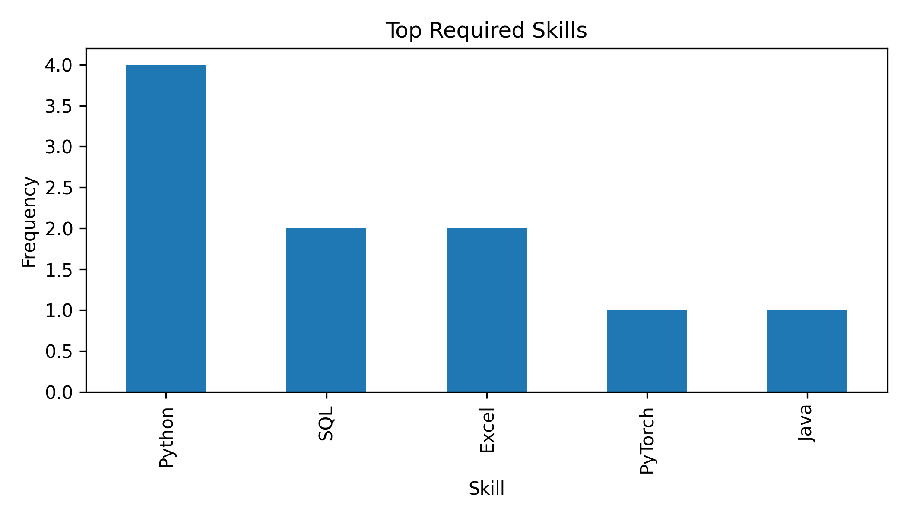

# Recruitment Data Analytics Pipeline

[](https://github.com/qiuqiuqiu12277/Recruitment-Data-Analytics-Pipeline/actions/workflows/ci.yml)

A reproducible Python pipeline that turns recruitment CSV data and free-text job
descriptions into validated, analysis-ready features, summary metrics, and charts.
It is designed as a portfolio project: the included data and the built-in demo
generator are synthetic and contain no applicant or employee information.

中文简介：项目支持中英文工作年限抽取、可配置技能词典、输入数据校验、稳健 CTR
计算、摘要指标与自动出图。仓库中的示例数据均为合成数据。

## What it demonstrates

- A conventional `src/` package with both module and console-script entry points.
- Schema validation with useful, aggregated error messages.
- Unicode/whitespace cleaning and exact-record deduplication.
- English and Chinese experience parsing, including `1-3 years`, `3+ years`,
  `三至五年`, `至少2年`, `3年以上`, and fresh-graduate wording.
- Boundary-safe skill extraction: `Java` is not incorrectly found in
  `JavaScript`, and the single-letter skill `R` is not found in `recruitment`.
- A configurable JSON skill dictionary for domain-specific vocabularies.
- Safe CTR calculation (`NaN` for zero views) and weighted overall CTR.
- Deterministic synthetic data generation for a fully offline demonstration.
- Stable record IDs, per-row quality issues, and strict row-count conservation.
- A human-review gate where warning/critical rows require explicit approval or rejection.
- SHA-256 approval manifests and verified exports that fail if approved data is changed.
- Unit and end-to-end tests.



## Quick start

Python 3.9 or newer is required.

```bash
python -m venv .venv
source .venv/bin/activate        # Windows: .venv\Scripts\activate
python -m pip install -e ".[dev]"
```

Run a complete, deterministic demo (generate data, validate, enrich, summarize,
and create charts):

```bash
python -m recruitment_pipeline demo \
  --output-dir outputs/demo \
  --rows 100 \
  --seed 42
```

To exercise analytics, review, approval, manifest verification, and export in one privacy-safe
run, use the synthetic workflow demo:

```bash
recruitment-pipeline workflow-demo \
  --output-dir outputs/workflow-demo \
  --rows 100 \
  --seed 42
```

For demonstration only, this command applies a visible deterministic policy: approve warning
rows and reject critical rows, recording `synthetic-demo-policy` as the reviewer. Real data should
use the separate commands below so a person supplies the decisions.

Or process the included synthetic CSV:

```bash
python -m recruitment_pipeline run \
  --input data/raw_jobs.csv \
  --output-dir outputs/sample
```

After installation, the equivalent console command is
`recruitment-pipeline`. Run either entry point without a subcommand to see help.

## Auditable review and approval workflow

The analytics output can continue through an explicit four-stage publication gate:

```text
run -> review -> approve -> export
```

Create a quality-labelled queue and a decisions template:

```bash
recruitment-pipeline review \
  --input outputs/sample/processed_jobs.csv \
  --output-dir outputs/sample/review
```

Every input row receives a deterministic `record_id`, exactly one `quality_status`
(`clean`, `warning`, or `critical`), and a JSON `quality_issues` list. The review summary asserts
that the input count equals `clean + warning + critical`; no row can silently disappear.

Open `decisions_template.csv` and enter `approve` or `reject` for every warning/critical row.
Reviewer and note fields are optional but useful for an audit trail. Then run:

```bash
recruitment-pipeline approve \
  --review-queue outputs/sample/review/review_queue.csv \
  --decisions outputs/sample/review/decisions_template.csv \
  --output-dir outputs/sample/approved
```

Clean records pass the automatic clean gate unless the decisions file explicitly rejects them.
Warning and critical records never pass by default: the command stops before writing approved
artifacts if even one flagged record lacks a decision.

Finally, verify the manifest and export:

```bash
recruitment-pipeline export \
  --approved outputs/sample/approved/approved_jobs.csv \
  --manifest outputs/sample/approved/approval_manifest.json \
  --output outputs/sample/delivery/jobs.csv
```

The manifest links the review queue, decisions, approved data, and full approval audit with
SHA-256 hashes. Export refuses modified approved data and writes a hash-linked receipt. This is a
portable safeguard, not a substitute for access controls or a regulated production approval
system.

## Input schema

CSV headers are trimmed, converted to snake case, and matched case-insensitively.
Common Chinese headers such as `职位名称`, `职位描述`, `浏览量`, and `点击量` are
also recognized.

| Column | Type | Rule |
| --- | --- | --- |
| `job_id` | string | Required, non-empty, unique |
| `job_title` | string | Required, non-empty |
| `job_description` | string | Required; missing text becomes an empty string |
| `location` | string | Required; missing text becomes an empty string |
| `views` | integer | Required, finite, non-negative |
| `clicks` | integer | Required, finite, non-negative, and not greater than views |
| `date` | date/datetime | Required and parseable |

Extra columns are preserved. Exact duplicate rows are removed; conflicting rows
with the same `job_id` are rejected instead of being silently overwritten.

## Outputs

Each pipeline run writes the following small, Git-ignored artifacts:

```text
outputs/sample/
├── processed_jobs.csv
├── summary.json
└── figures/
    ├── ctr_by_job_title.png
    ├── experience_distribution.png
    └── skill_frequency.png
```

`processed_jobs.csv` adds `experience_min_years`, `experience_max_years`,
`experience_level`, `skills`, and `ctr`. Skills are stored as a JSON array so
other tools can parse the column reliably. An open-ended requirement such as
`3+ years` has a minimum of `3` and an empty maximum.

`summary.json` contains record and location counts, date coverage, total views
and clicks, weighted overall CTR, mean/median posting CTR, zero-view counts,
experience buckets, top skills, and basic data-quality counts. CTR by job title
is also weighted from aggregated clicks and views rather than averaging ratios.

Use `--no-charts` for a faster data-only run and `--top-n 15` to change the
number of skills/job titles reported.

The gated workflow adds:

```text
review/
├── review_queue.csv
├── decisions_template.csv
└── review_summary.json
approved/
├── approved_jobs.csv
├── approval_audit.csv
└── approval_manifest.json
delivery/
├── jobs.csv
└── jobs.receipt.json
```

## Custom skill dictionary

Pass a UTF-8 JSON object whose keys are canonical output names and whose values
are alias arrays:

```json
{
  "Data Governance": ["data governance", "数据治理"],
  "Large Language Models": ["large language model", "LLM", "大语言模型"]
}
```

```bash
python -m recruitment_pipeline run \
  --input data/raw_jobs.csv \
  --output-dir outputs/custom \
  --skills-config skills.json
```

Matching is Unicode-aware, case-insensitive, and protects ASCII token
boundaries. Add aliases explicitly when a technology is commonly embedded in a
larger token (for example, the default `SQL` skill includes `MySQL`).

## Generate demo data only

```bash
python -m recruitment_pipeline generate-demo \
  --output outputs/synthetic_jobs.csv \
  --rows 250 \
  --seed 7
```

The same seed and row count produce the same records. The generator deliberately
includes bilingual descriptions and a small number of zero-view postings to
exercise edge cases without using scraped or private data.

## Python API

```python
from recruitment_pipeline import run_pipeline

result = run_pipeline(
    "data/raw_jobs.csv",
    "outputs/api-run",
    top_n=10,
)
print(result.summary_json)
```

## Tests

```bash
pytest
```

The suite covers schema failures, text normalization, Chinese/English experience
ranges, skill-boundary regressions, division by zero, summary calculations,
chart creation, serialized output, row-count conservation, mandatory flagged-row
decisions, manifest tamper detection, and the `python -m recruitment_pipeline`
workflow.

## Project layout

```text
Recruitment-Data-Analytics-Pipeline/
├── data/raw_jobs.csv
├── notebooks/recruitment_EDA.ipynb
├── src/recruitment_pipeline/
│   ├── analysis.py
│   ├── cli.py
│   ├── demo.py
│   ├── features.py
│   ├── pipeline.py
│   ├── preprocessing.py
│   ├── review.py
│   └── schema.py
├── tests/
├── pyproject.toml
└── requirements.txt
```

## Privacy and scope

This repository intentionally ships only synthetic demonstration data. Do not
commit applicant CVs, contact details, internal requisition data, access tokens,
or exports containing personal information. The pipeline is an analytics
demonstration, not an automated hiring or candidate-ranking system.
